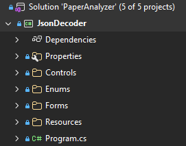

# Comentários sobre a implementação
## Questões de legibilidade do código
## 1. Padrão de nomenclatura

O C# usa dois padrões de nomenclatura:

| <center>Padrão</center> | <center>Aplicação</center> | <center>Descrição</center> |
| :--- | :--- | :--- |
| PascalCase | Nomes de classes e outras entidades, métodos, propriedades e constantes | Todas as iniciais maiúsculas e demais letras minúsculas |
| CamelCase | Nomes de variáveis | Primeira inicial minúscula, demais iniciais maiúsculas e demais letras minúsculas |

## 2. Separação de classes

É uma boa prática separar classes diferentes em seus próprios arquivos.

Mesmo entidades como Enums e Structs podem ser declaradas em arquivos totalmente independentes se forem declarados como públicos.

Para entidades não públicas, que precisam estar aninhadas em uma classe mãe, ainda que não seja possível independência total, é possível deixá-las separadas em arquivos independentes usando classes parciais. Exemplo:

####  2.1. Exemplo de classe mãe
```csharp
/// <summary>
/// Classe principal pública, declarada no arquivo ClasseMae.cs
/// </summary>
namespace ExemploClasseAninhada
{
    public partial class ClasseMae
    {
        /* Ponha aqui o código que é exclusivo da classe mãe */
    }
}
```

A palavra-chave "partial" permite que você possa dividir partes da mesma classe ema arquivos diferentes.

####  2.2. Exemplo de classe aninhada privada em arquivo separado
```csharp
/// <summary>
/// Classe aninhada privada, declarada no arquivo ClasseMae.ClasseAninhada.cs
/// </summary>
namespace ExemploClasseAninhada
{
    public partial class ClasseMae
    {
        public class ClasseAninhada
        {
            /* Ponha aqui o código que é exclusivo da classe aninhada */
        }
    }
}
```

### Observações:
- Assim como no arquivo principal, os demais arquivos usam a palavra-chave "partial".
- É importante garantir que todas todas as declarações da classe parcial tenham o mesmo nome e estejam no mewsmo namespace.
- Não faz diferença se a classe aninhada é pública ou privada, mas a classe raiz precisa ser pública.
- Como a classe aninhada está totalmente contida em um arquivo, ela não precisa ser uma classe parcial.
- O efeito prático disso é que, mesmo a classe mãe estando dividida em múltiplos arquivos, o compilçador entende que é uma entidade só.

## 3. Organização das pastas
Todo projeto .Net tem um namespace raiz, onde ficam os arquivos e pastas principais do projeto, conforme exemplo abaixo:



### Neste exemplo temos:
- A Solution, que agrupa vários projetos em uma unidade coesa e integrada, chamada "PaperAnalyzer" que está no arquivo "./PaperAnalyzer.sln".
- O projeto C# chamado "JsonDecoder", que está no arquivo "./JsonDecoder/JsonDecoder.csproj"
- As configurações de inicialização do projeto na pasta "./JsonDecoder/Properties"
- O Namespace Controls, na pasta "./JsonDecoder/Controls"
- O Namespace Enums, na pasta "./JsonDecoder/Enums"
- O Namespace Forms, na pasta "./JsonDecoder/Forms"
- A pasta de recursos embutidos do projeto (imagens, textos, etc.), na pasta "./JsonDecoder/Resources", vou explicar isso depois
- A classe de inicialização do projeto (específico para projetos do tipo console e outros), no arquivo "./JsonDecoder/Program.cs"

### Orientações importantes:
- As pastas "Properties" e "Resources" possuem função especial, evite usar essas pastas para outras funções.
- Aa pasta "Properties" é criada automaticamente quando você cria um projeto novo usando o Visual Studio classico ou o a linha de comando do .Net Cli
- A pasta "Resources" é criada automaticamente quando voce adiciona algum recurso nas propriedades do projeto através do Visual Studio Clássico ou péla linha de comando do .net Cli
- Quando você usa o Visual Studio clássico, ele usa algumas funcionalidades automáticas:
    - Qualquer classe criada na raiz do projeto usa o namespace raiz por padrão
    - Qualquer classe criada em uma subpasta do projeto assume o namespace igual à estrutura de diretório
    - Ao mover uma classe de um diretório para outro, o Visual Studio oferece automaticamente a opção de refatoração automática do namespace
    - No VS Code, essas facilidades não existem e você precisa cuidar disso manualmente

Exceto pelas pastas dos namespaces, essa estrutura não foi criada manualmente. Tudo é criado automaticamente quando voc usa o Visual Studio clássio ou o .Net cli para criar o projeto.

## 4. Uso do operador de nullable (operador ?) e diretiva `<Nullable>enable</Nullable>`
Caso seu projeto tenha a tag `<Nullable>enable</Nullable>` dentro do bloco `<PropertyGroup>` (o seu projeto tem e isso é padrão desde o .net8), isso significa que o IDE fará verificação ativa de valores nulos e irá gerar muitos warnings sempre que houver possibilidade de alguma coisa ficar nula.

Removendo essa diretiva esse erro desaparece e algumas coisas no código mudam:

### Com Nullable = enabled
- Argumentos de funções e variáveis do tipo Class ou Object precisam ser delcarados como:
```csharp
Tipo? minhaVariavel
Object? minhaVariavel
```

Isso impede que a variável possar assumir o valor null de forma acidental, obrigando você a usar o operador ? para indicar isso explicitamente.

Deste modo, você receberá warnings sempre que existir a possibilidade da variável recber valor nulo sempre que o operador `?` não for usado.

### Com Nullable = disabled (ou quando essa diretiva não é declarada)
- Argumentos de funções e variáveis do tipo Class precisam ser delcarados como:
```csharp
Tipo minhaVariavel
Object? minhaVariavel
```

Deste modo, todos os warnings desaparecem e não existe verificação de nulidade no IDE.

### Exceção a essa regra
Alguns tipos de dados não são capazes de receber valor nulo, mesmo se voc~e fizer uma atribuição implícita. Esses tipos são chamados de "Não anuláveis". Isso inclui:
- Structs (incluindo tipos primitivos, que derivam de struct)
- Enums
- Tuplas

Quando você atribui null a um desses tipos, ele assume um valor padrão não nulo.

Se você realmente quiser que eles possam assumir valor nulo, você precisa declarar explicitamente. Por esse motivo, eles não geram Warning se voc~e não usar o operador `?`.

Exemplos:
```csharp
int x; ///Essa variável não pode assumir valor nulo nem se você fizer uma atribuição explícita
int? x; /// Essa variável pode assumir valor nulo
```

Existe mais de uma forma de declarar uma variável do tipo nullabel.

Exemplos:
```csharp
int? x; ///Esta é a forma mais limpa e menos verbosa
nullable<int> x; /// A forma acima é uma simplificação para esta forma, que usa generics
```

